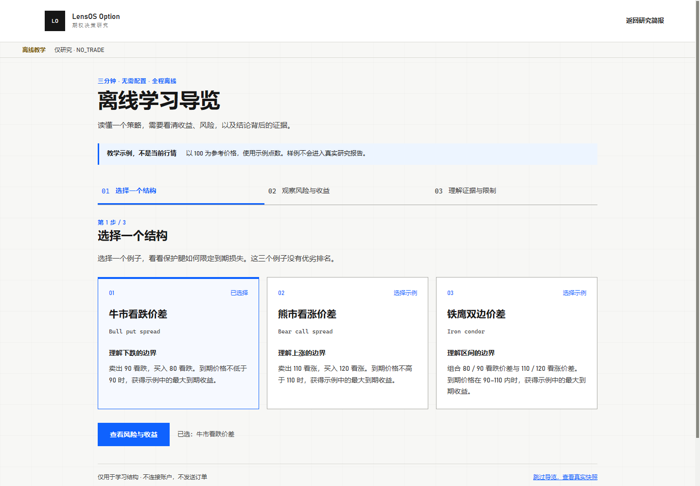

# Crypto Options Research Console

[English](README.en.md) · 中文

[](https://github.com/Lens-less/LensOS-Option/actions/workflows/ci.yml)
[](https://github.com/Lens-less/LensOS-Option/releases/latest)
[](LICENSE)


[文档](docs/README.md) · [参与贡献](CONTRIBUTING.md) · [安全政策](SECURITY.md) ·
[社区行为准则](CODE_OF_CONDUCT.md) · [变更记录](CHANGELOG.md) ·
[v0.1.0 发布说明](docs/releases/v0.1.0.md)

一个**期权入场前的研究工具**：它读取 Deribit 的公开行情，判断“现在有没有一个
值得考虑的卖方机会”，并把结论所依赖的每一份证据都摊开给你看。

它面向的是**自己做决策的期权卖方**——你想要一份可复核、可回放的入场前分析，而
不是一个替你下单的黑盒。

**它不做什么：** 不连接下单接口，不给推荐手数，不做自动或半自动执行。可信输出的
上限是一份 `execution_allowed=false` 的准入结论。这是刻意的设计边界，不是待办事项。

它的两个核心特性：

- **evidence-first**：每个结论都能追溯到具体证据。没有证据支撑的数字不会被编造出来，
  而是显式标记为“缺失”。
- **fail-closed**：证据缺失、过期或校验失败时，一律降级为“阻断”。**没有信号 ≠ 放行。**



_wheel 内置快照的真实演示界面：演示标识、`RESEARCH_ONLY · NO_TRADE` 与阻断原因保持可见。_

## 两种使用形态

| 形态 | 用途 |
| --- | --- |
| **Web research workbench** | 筛选、排序、并排对比候选，逐个查看打分依据与收益曲线。挖掘与理解的主场。 |
| **Chrome research companion** | 在 Deribit 页面上就地回答“我正在看的这张合约有没有 edge、同链有没有更好的”。 |

CLI 与 HTTP API 是驱动这两个界面的**本地引擎接口**，供集成、调度与自动化使用，
不作为独立产品维护。

公开静态 bundle 只包含证据站与法务页，不包含 workbench 或 Chrome companion；这两个
界面属于内部 / 本地形态。

## 公开发布

- 当前稳定版本是 [`v0.1.0`](https://github.com/Lens-less/LensOS-Option/releases/tag/v0.1.0)；
  wheel、Chrome 扩展 ZIP、校验和与完整说明均从 GitHub Release 提供。
- 代码以 `Apache-2.0` 许可发布，见 [`LICENSE`](LICENSE)。
- 公开数据产物与生成的公开研究内容以 `CC BY 4.0` 许可发布，见
  [`LICENSE-DATA`](LICENSE-DATA)。
- 公开静态页以中文为主；英文镜像（如发布）位于 `/en/` 之下。
- 公开 headline 由已收盘的每日数据发布，刻意比采集日滞后一天。
- 八阶段工作流作为方法页的次级披露保留，不作为首页叙事。
- 本仓库不声称公开域名、外部心跳或独立证据仓已经配置完成；这些属于
  运维手册中描述的部署契约。

---

## 快速开始

只需 Python ≥ 3.12。以下两条命令直接安装正式 wheel 并打开演示：

```powershell
python -m pip install https://github.com/Lens-less/LensOS-Option/releases/download/v0.1.0/crypto_options_research_console-0.1.0-py3-none-any.whl
crypto-options-report demo
```

wheel 安装完成后，演示运行时零第三方依赖，不需要 Node、API 密钥、外网、本地采集产物
或任何 owner 基础设施。若要从源码安装：

```powershell
git clone https://github.com/Lens-less/LensOS-Option.git
Set-Location LensOS-Option
python -m pip install .
crypto-options-report demo
```

命令默认只监听 `127.0.0.1`，并用 wheel 内置的脱敏固定快照启动只读界面；页面会始终
标明“演示 / 快照数据”，不会把回放伪装成实时行情。按 `Ctrl+C` 即可退出。端口被占用时，
命令会给出明确错误，不会静默改用其他端口。打开命令输出的链接（默认
<http://127.0.0.1:8000/index.html?view=workbench>）即可开始。

> **没有配置市场数据源时会看到大量“不可用 / 缺失”，这是正常的。** 产品按设计拒绝
> 编造任何数值。空状态会列出缺什么、以及补齐它的确切命令。
>
> 同理，production 模式下 `/readyz` 会稳定返回 `503`：当前没有可提升的模型，
> 就绪门禁按设计保持关闭。**这不代表进程异常**，`/livez` 才表示进程存活。

## 操作者车道（Windows-only，可选）

本节及后文的日采集、计划任务与静态发布只用于维护一个持续运行的公开实例，依赖
PowerShell、可选的私有证据仓和外部托管。它们不是快速开始或贡献代码的前置条件。

### 静态公开版与发布

公开站不运行会访问 Deribit 或持有凭证的服务。日更任务先用
[`tools/capture-daily.ps1`](tools/capture-daily.ps1) 固化市场快照、标的历史、DVOL 历史与研究产物，
再把经过白名单裁剪的报告和前端一起发布成纯静态目录：

```powershell
$siteOrigin = $env:LENSOS_PUBLIC_SITE_ORIGIN
if ([string]::IsNullOrWhiteSpace($siteOrigin)) {
  throw '请先把 LENSOS_PUBLIC_SITE_ORIGIN 设为最终自有 HTTPS 域名。'
}

crypto-options-report publish `
  --snapshot artifacts/snapshots/btc-series/<capture>.json `
  --underlying-history artifacts/history/btc-daily.json `
  --dvol-history artifacts/history/btc-dvol.json `
  --signal-artifact artifacts/reports/signal-preflight.json `
  --series-artifact artifacts/reports/series-history.json `
  --publication-history artifacts/reports/publication-history.json `
  --web-build web/dist-public `
  --site-origin $siteOrigin `
  --out dist/site --published-at <UTC-RFC3339> --git-sha <commit>
```

`--site-origin` 必须是最终自有的 HTTPS 纯域名（不能带路径、查询、凭证或非默认端口）；
它会进入 canonical 分享元数据、`robots.txt` 与 `sitemap.xml`。发布器会拒绝
`example.*`、`.invalid`、`.alt`、localhost、单标签域名和 IP 字面量；正式工作流还会拒绝
解析到 IANA 特殊用途/非公网地址的主机。未确定正式域名时只构建并测试 `web/dist-public`，
不要生成带虚假 canonical 的发布树。

输出目录按 Cloudflare Pages 的 `_headers` 契约构建。质量门禁失败、VRP 历史不足或含账户/仓位/订单字段时
发布器会失败关闭；浏览器检测到数据截止时间已超过 48 小时后，整站进入“发布已停摆”态。
完整接口与运维约定见
[公开 API](docs/api-public.md) 和[静态发布手册](docs/operations/public-publishing.md)。

公开 bundle 只包含公开观测站所需的静态页面与 JSON，不包含 workbench 或 Chrome companion。

`research_publication` 只回答“这份静态研究能否公开”；`execution_authorization` 只回答
“系统能否用于交易执行”。两者互不提升，后者永久保持 `NO-GO`。

## 核心概念

读其他文档前，建议先了解这几个词（完整定义见 [术语表](docs/glossary.md)）：

| 术语 | 含义 |
| --- | --- |
| `research_only` | 输出的固定模式：仅供研究，不构成下单指令。不会被任何配置改变。 |
| mode gate（模式门禁） | 拦截一切越界输出的检查点。交易建议、推荐手数、下单指令都被它挡住。 |
| `AnalysisRecord` | 一次分析的**不可变**完整记录，可信输出的载体。 |
| `EntryAdmissionDecision` | 可信输出的**上限**：“能不能进场考虑”，恒有 `execution_allowed=false`。 |
| evidence class | 证据可信度：`trusted` / `degraded` / `untrusted` / `missing`。 |
| replay（可回放） | 同一份快照 + 同一个显式时钟 ⇒ 输出逐字节一致，结论可被独立复核。 |

## 当前状态

| 能力 | 状态 |
| --- | --- |
| 本地确定性 / 回放研究工具链 | **GO** |
| 经过发布器校验的静态研究产物 | **GO** |
| paper / manual 交易、自动下单、真实账户执行 | **NO-GO** |
| 校准与模型提升（model promotion） | 未实现；规格已定稿、轴已事前登记（见 [model-promotion.md](docs/model-promotion.md)） |
| 交易执行授权 | **NO-GO（永久）** |

WebSocket gap/resync、24 小时 soak 与连续 7 天证据仍属于内部运行/执行就绪度，
不会阻止满足数据质量、可复算性和隐私边界的静态研究发布，也不会被静态发布反向放宽。

## 使用方式

### 找出有 edge 的候选

产品的核心问题是“现在这条链上，哪个卖点最划算”。它分两层回答，**不要混淆**：

- **相对价值** — 该行权价相对自身微笑曲线是贵还是便宜。只需当前链条，随时可得。
- **绝对预期价值** — 收信用 − 预期赔付 − 手续费。需要标的的历史收益分布。

先抓一份标的历史（公开数据，无需凭证）：

```powershell
crypto-options-underlying-history --currency BTC --days 1200 `
  --output artifacts/history/btc-daily.json --horizon-days 7 --horizon-days 18
```

它会直接告诉你每个持有期有多少**独立**窗口。窗口不足时对应期限会被阻断，而不是
给出一个样本量不够却看起来很精确的数字。

```powershell
crypto-options-report scan `
  --snapshot-fixture artifacts/snapshots/btc-chain.json `
  --underlying-history-fixture artifacts/history/btc-daily.json --compact
```

排名用 **Pareto 前沿 + 已发布的字典序**，不做加权求和——给不同量纲的分量配权重，
等于声明一个未经证实的相对重要性。被支配的候选会附带“输给了谁、输在哪几个维度”。
当前沿吞掉几乎全部候选（6 个维度下很常见），`frontier_occupancy` 会如实报告排序实际上
已经退化成第一个维度的字典序。

> **样本量只认独立非重叠窗口。** 从 1200 天日线算 18 天持有期，会得到 1183 个重叠
> 窗口但只有 66 个独立窗口。用前者当样本量会把置信度虚报约 18 倍。

### 候选宇宙

发掘覆盖 call 与 put 两侧，结构由**带符号的腿集合**表达而不是结构名，因此终值盈亏、
最大亏损与仓位希腊值对任意组合都是同一段代码算出来的：

| 结构 | 风险 |
| --- | --- |
| `naked_short_calls` | 无界（`max_loss` 为 `None`，下游比率因此无法成立） |
| `call_credit_spreads` | 有限 |
| `put_credit_spreads` | 有限 |
| `iron_condors` | 有限，双边 |

表名由报告里的 `structure_types` 发布，不需要在消费端硬编码。

### 这几个一起做会怎样

`combination_risk` 把前沿候选当作一个假想组合来看（每个结构一张，**不含任何手数**）：

- **跨到期日不给联合最大亏损**，只给明确标注的上界（各成员最坏情况之和）；只有全部腿
  同一到期日时才算真正的联合 payoff。两个方向相反的价差合起来的最坏情况远小于两者之和。
- 净 vega 与**按到期日拆分的 vega** 并列——净值隐含“波动率平行移动”这个假设。
- 边际贡献按“把它移出组合”来算，而不是它自己的最坏情况。

### 这个行权价昨天也这么贵吗

每日采集本来是为验证样本攒的，但它同时已经回答了另一个问题。

```powershell
crypto-options-report series-history `
  --snapshot-dir artifacts/snapshots/btc-series --compact
```

`tools/capture-daily.ps1` 每次采集后会自动重建这份产物；把它交给引擎（`--series-artifact`）
就能在“序列历史”页里看到**合约 × 采集日**的标准化残差热力图。

三个刻意的设计：

- **用标准化残差而不是原始 IV。** 合约每天都在临近到期，IV、delta、权利金都会因此移动，
  与错价无关；只有按各到期日自身残差尺度标准化后的值才跨日可比。
- **缺采集不是零。** 采集器从几百个挂牌合约里选约一百个、且随现价漂移，所以缺席很常见。
  空心格是“没采”，实心格才是读数，两者从不互相冒充。
- **排序按向零收缩的均值。** 否则只出现三天的合约会靠三个读数排到最前面——这正是这个
  项目到处在防的样本量错误。收缩常数是发布的。

> **持续为正不等于机会。** 一条始终为正的残差，同样可能说明二次拟合在那个行权价上
> 跟不上真实的翼部。这张图在两种情况下长得一样，所以这句话印在图的**上面**而不是下面。

### 这个排序到底能不能预测什么

**先说数据来源的硬约束：** Deribit 公开 API **不发布历史期权链**。
`get_instruments(expired=true)` 只返回最近一批已到期合约（实测仅当天一个到期日），
逐合约的 TradingView K 线也只对成交过的合约有数据、且不含 IV 与买卖盘。
所以这个验证**无法回溯补数**，只能从今天开始按天采集，等合约自然到期。

#### 操作者采集与计划任务（Windows-only）

下面的日采集与 Windows 计划任务是可选的运营车道，不属于陌生人快速开始。每天抓一次，
文件按采集时间命名，不会互相覆盖：

```powershell
crypto-options-report pull-snapshot --currency BTC --instrument-limit 64 `
  --output-dir artifacts/snapshots/btc-series --compact
```

`tools/capture-daily.ps1` 把这一步和标的历史刷新打包成一次采集，**历史必须一起刷新**：
它提供每个已结算到期日的结算价，历史过期会让最近结算的 cohort 悄悄掉出样本。注册为
每日计划任务（本地 17:00，即 Deribit 08:00 UTC 结算之后）：

```powershell
$repo = "C:\path\to\Option"
$evidenceRepo = "C:\path\to\LensOS-Option-Evidence"
$action = New-ScheduledTaskAction -Execute "powershell.exe" `
  -Argument "-NoProfile -NonInteractive -ExecutionPolicy Bypass -File `"$repo\tools\capture-daily.ps1`" -RepoRoot `"$repo`" -CaptureOrigin local_windows_scheduler -EnableEvidenceRepoSync -EvidenceRepoRoot `"$evidenceRepo`" -EvidenceRepoRemote origin -HistoryDays 1200 -DvolHistoryDays 1095" `
  -WorkingDirectory $repo
$trigger = New-ScheduledTaskTrigger -Daily -At 17:00
$settings = New-ScheduledTaskSettingsSet -StartWhenAvailable -AllowStartIfOnBatteries `
  -DontStopIfGoingOnBatteries -ExecutionTimeLimit (New-TimeSpan -Minutes 45) `
  -RestartCount 3 -RestartInterval (New-TimeSpan -Minutes 20)
Register-ScheduledTask -TaskName "LensOS-Option-DailyCapture" `
  -Action $action -Trigger $trigger -Settings $settings -Force
```

失败通知和成功 dead-man ping 分别从 `CAPTURE_DAILY_FAILURE_WEBHOOK_URL` 与
`CAPTURE_DAILY_SUCCESS_HEARTBEAT_URL` 读取。不要把 webhook URL 直接写进可被其他本机用户
读取的计划任务参数；应通过运行该任务的专用账户注入。外部监控还必须独立拉取公开
`health.json` 并比较 `stale_after`，成功 ping 不能替代这条正向检查。

摘要与两个通知 payload 都会写入 `usable_for_validation`、可用性 reason codes，以及连续
可用/不可用天数。即使脚本退出成功，只要连续两个采集日没有推进验证序列，也会触发失败
webhook；快照阶段失败时，互不依赖的标的历史和 DVOL 历史仍会继续刷新。

第二采集点已选定为 GitHub Actions 的 `08:10 UTC` 车道，标识为
`github_actions_0810_utc`。配置私有 evidence repo 与两个通知端点后，用不可变 receipt
验收连续三天的双车道数据。`$evidenceRepo` 必须指向干净、已把当前命名分支完整推送到
`origin` 的私有 Git 仓顶层；工具会核对远端 commit 中的 receipt 与 snapshot blob。
退出码 `0/10/11` 分别表示通过/继续收集/证据无效：

```powershell
python tools/check-dual-capture-acceptance.py `
  --evidence-root $evidenceRepo `
  --required-origin local_windows_scheduler `
  --required-origin github_actions_0810_utc `
  --days 3
```

采集日志在 `artifacts/logs/capture-daily.log`。同一天跑多次是安全的：验证器按
“日期 × 合约”去重并报告丢弃了多少条，不会让重复行把当日横截面的相关性拉紧。

**攒够 8 个 cohort 需要约 2 个月，不是几周。** 7–35 天窗口内同时只挂着 3 个到期日，新的
周度到期日每周才进来一个。Deribit 确实有 1–5 天的日到期合约（看起来能把速度提高八倍），
但历史样本显示**它们过不了数据质量门禁**（`INVALID_BID_IV` /
`INSUFFICIENT_VALID_QUOTES`）。纵向 series/preflight 现在会只隔离失败的到期日，健康到期日
仍可进入对应 cohort；全链报告与公开发布仍维持整份快照阻断，所有阈值保持不变。采集窗口
继续保持在 7–35 天，不用低质量日到期合约换验证速度。

等待期间用 preflight 监控采集是否真的在产出观测——**采集不可回补，一个缺陷不被发现多久
就浪费多久**：

```powershell
crypto-options-report validate-signal --preflight `
  --snapshot-dir artifacts/snapshots/btc-series `
  --underlying-history-fixture artifacts/history/btc-daily.json --compact
```

它按到期日列出已结算 / 待结算的 cohort、每个能贡献多少观测、以及被什么挡住了。

把产物交给引擎，就能在界面的“信号验证”页里读，不必反复跑命令看 JSON：

```powershell
python -m crypto_options_report.api --replay `
  --snapshot-fixture <快照> --underlying-history-fixture artifacts/history/btc-daily.json `
  --signal-artifact artifacts/reports/signal-preflight.json
```

攒够之后：

```powershell
crypto-options-report validate-signal `
  --snapshot-dir artifacts/snapshots/btc-series `
  --underlying-history-fixture artifacts/history/btc-daily.json --compact
```

样本不足时它会 `blocked` 并写明差多少——**这是正常的，不是故障**。

它一次度量 10 个候选信号（微笑残差的三种量纲、IV 减历史波动率、IV 减 DVOL、期限溢价、
局部偏斜、持仓量占比、深度失衡、报价宽度），并附一份**共线性报告**：数信号不等于数信息。
任何形如“IV 减去一个当日常数”的信号在当日内秩完全相同——拿 DVOL 减和拿历史波动率减
是同一个排序穿了两件衣服。`distinct_signal_estimate` 给出实际有几个不同的排序。

### EV 是负的，到底是哪一种负

一个负的预期价值至少对应三种处境，应对方式相反：样本期恰好包含了卖方被套的那波行情；
edge 真实存在但夹在买卖价之间；或者卖这个形状本来就不划算、有意思的是另一边。

```powershell
crypto-options-report ev-robustness `
  --snapshot-fixture artifacts/snapshots/btc-series/<capture>.json `
  --underlying-history-fixture artifacts/history/btc-daily.json --compact
```

它把三者拆开：**执行敏感度**（在买价/中价/卖价上，买卖两个方向各自的 EV）和
**期间敏感度**（在连续历史切片上重算，看符号是否翻转）。预期赔付与开仓价格无关，所以
四个执行变体不需要任何额外的路径重放，只有切片需要。

`verdict` 只命名数字显示了什么，不给建议：`sign_flips_across_periods`（水平本身没建立起来）、
`no_capturable_edge_at_the_touch`（公允价落在买卖价之间——这是正常市场，不是发现）、
`other_direction_is_positive`（错价在你没筛的那一边）、`negative_across_periods_and_execution`。

它用**生产代码路径本身**逐日产出候选，与到期后的真实盈亏配对，给出分档表与信息系数。
两个设计决定了它是否值得信：

- **样本量按到期日 cohort 计**，不按观测数。相邻两天的快照是同一批合约、同一个结算价。
- **相关性先做 moneyness 中性化**。原始相关系数被虚值程度主导——一个等价于“按行权价
  排序”的信号在毫无错价信息的对照组里也能拿到 0.95 的 IC。原始值仍并列展示，好让你
  看见这个混淆有多大。

排序主轴自身也在被度量之列，结果可能是 `no_detectable_edge`。**这正是它存在的意义。**

**只有一个轴可以从这份样本被提升。** 2026-07-27（当时 0/8 个 cohort 已结算）事前登记了
`smile_residual_z`，阈值 `|t| ≥ 2.0`。其余九个信号是探索性的——即使某个得分更高，也只能
用于设计下一次登记，不能从这份样本提升。理由是多重比较：约 7 个不同排序下，在同一份样本上
挑最高分再提升，常规阈值有相当概率从噪声里挑出“赢家”。登记内容随验证产物一起发布
（`pre_registration`），界面上也会标出登记轴与本样本得分最高者的区别。

### CLI（内部管道）

```powershell
# 抓取一份实时公开快照，供离线分析
python -m crypto_options_report.cli pull-snapshot --instrument-limit 20 `
  --output artifacts/snapshots/btc-chain.json --compact

# 基于快照产出报告；市场数据被阻断时退出码为 10
python -m crypto_options_report.cli report `
  --snapshot-fixture artifacts/snapshots/btc-chain.json `
  --output artifacts/reports/latest.json --fail-on-blocked --compact

# 研究性风险告警（不含任何下单路径）
python -m crypto_options_report.cli alert-eval `
  --snapshot-fixture artifacts/snapshots/btc-chain.json --dry-run --compact
```

调度器可用的退出码：`0` 成功 · `10` 市场数据阻断/缺失 · `11` 触发告警 · `1` 硬错误。
完整示例见 `crypto-options-report --help`。

### HTTP API 与 Evidence Console

Evidence Console 与 API **固定同源**，避免跨源配置和浏览器参数改变生产报告语义。
服务端对同一组输入只生成一次 `AnalysisRecord`，各 GET 投影复用同一份记录，不会重新
拉取数据或重算结论。

主要端点：`/evidence`（控制台）· `/research/report` · `/analysis/result` ·
`/health` · `/livez` · `/readyz`。完整列表、鉴权要求与响应契约见
[API 参考](docs/api-reference.md)。

### Chrome 研究伴侣（个人本地）

面向个人本地使用的 Manifest V3 侧边栏（Chrome 114+）。从
[`v0.1.0` Release](https://github.com/Lens-less/LensOS-Option/releases/tag/v0.1.0)
下载 `lensos-option-chrome-extension-v0.1.0.zip` 并解压；先运行
`crypto-options-report demo`，再在 `chrome://extensions` 打开“开发者模式”→
“加载已解压的扩展程序”→选择解压后的目录。

从源码构建时：

```powershell
cd web
npm ci
npm run build:extension
```

选择 `web/dist/chrome-extension/`，然后在 Deribit 页面点击工具栏图标。

侧边栏只读取 `http://127.0.0.1:<port>/research/report`，只识别当前 Deribit 合约并
展示研究上下文；**不包含订单、交易、张数或 sizing 控件**。合约上下文按标签页隔离。

## 生产部署

推荐把公共行情、私有只读账户和 Web API 拆成三个进程：凭证只存在于 sidecar 进程，
API 进程只读取脱敏后的 JSON。生产 HTTP 禁止浏览器指定 fixture、账户场景、评估时间
或实时抓取。

服务默认只监听 loopback，必须部署在认证 / TLS 反向代理之后，不能直接暴露到公网。

完整的容器、健康检查、HMAC 密钥管理、密钥轮换、回滚与验证步骤见
**[生产运行手册](docs/operations/production-runbook.md)**；环境变量清单见
[`.env.example`](.env.example)。

## 开发

```powershell
python -m venv .venv
.venv\Scripts\Activate.ps1
python -m pip install --upgrade -c constraints.txt pip setuptools
python -m pip install --no-build-isolation -c constraints.txt -e ".[dev]"
python -m pytest -q
python -m ruff check crypto_options_report tools tests

cd web
npm ci && npm test && npm run lint && npm run build
```

用仓库测试 fixture 做一次确定性 CLI 回放：

```powershell
python -m crypto_options_report.cli analysis `
  --snapshot-fixture tests/fixtures/deribit_btc_option_chain_snapshot.json `
  --generated-at 2026-07-07T00:01:30Z --compact
```

浏览器回放及完整接口说明见 [API 参考](docs/api-reference.md)；录制数据必须通过 operator
控制的 `--replay` 启动参数进入服务，不能由浏览器绕过新鲜度门禁。

`npm run build` 会更新 `crypto_options_report/static/evidence/`，该产物随 wheel 和
容器一起发布，**必须与源码一起提交**（CI 会校验一致性）。

贡献流程与设计红线见 [CONTRIBUTING.md](CONTRIBUTING.md)；社区约定见
[CODE_OF_CONDUCT.md](CODE_OF_CONDUCT.md)，安全问题请按 [SECURITY.md](SECURITY.md)
私下报告，版本变化见 [CHANGELOG.md](CHANGELOG.md)。

## 项目地图

| 路径 | 职责 |
| --- | --- |
| `crypto_options_report/analysis_run.py` | 不可变的 mandate、证据、策略与准入契约 |
| `crypto_options_report/contract.py` | `research_report.v1` 兼容投影 |
| `crypto_options_report/api.py` | stdlib HTTP API、`/evidence` 与旧 URL 兼容层 |
| `crypto_options_report/market_data.py` | Deribit 接入、快照规范化与质量门禁 |
| `crypto_options_report/structures.py` | 多腿结构：终值 payoff、风险边界、仓位希腊值 |
| `crypto_options_report/signal_validation.py` | 排序信号的预测力度量（分档表与信息系数） |
| `crypto_options_report/combination_risk.py` | 组合聚合与边际风险 |
| `crypto_options_report/_canonical.py` | 全局唯一的规范化 JSON 编码（所有摘要的基础） |
| `web/` | 共享报告边界、Evidence Console、Chrome 侧边栏源码 |
| `tests/` | 契约、API、数据质量、风险与 fail-closed 证据测试 |
| `docs/` | 术语表、API 参考、架构说明、运行手册（见 [文档地图](docs/README.md)） |

## 安全边界

本项目**刻意不包含实盘下单适配器**。可信输出上限是 `execution_allowed=false` 的
`EntryAdmissionDecision`，其中不含可执行张数或下单指令。裸卖 call 只作为“已拒绝的
无界损失对照”出现在可信记录中。

不要以“清理研究控制台”的名义加入订单模板、下单路径、paper/manual 候选控件或
sizing 输出。

漏洞请通过 GitHub Security Advisory 私下报告，详见 [SECURITY.md](SECURITY.md)。

Deribit 接入以官方 [public market-data API](https://docs.deribit.com/api-reference/market-data/public-get_order_book)
和 [OAuth / API key scopes](https://docs.deribit.com/api-reference/authentication/public-auth) 为准。
任何 `account:read_write` 或 `trade:read_write` key 都会被账户 sidecar 拒绝。

## 许可

代码按 [Apache-2.0](LICENSE) 发布；公开数据产物和生成的公共研究内容按
[CC BY 4.0](LICENSE-DATA) 发布。
