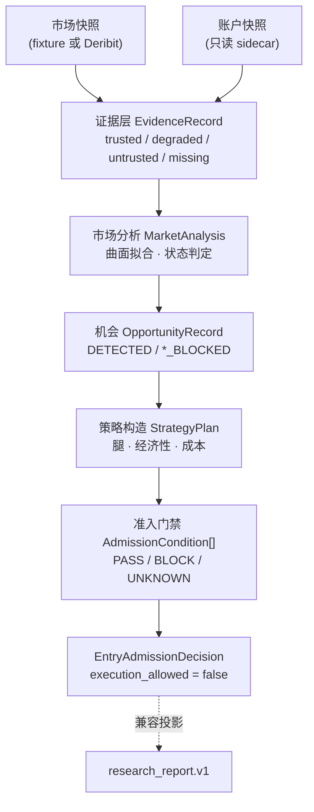
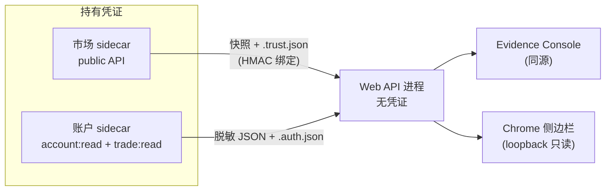

# 架构总览

面向贡献者。术语见[术语表](glossary.md)，端点契约见 [API 参考](api-reference.md)。

## 一句话概括

一条**单向的信任链路**：原始快照进来，逐段被降级或提升信任等级，最终止于一个
不可变的准入结论。链路上每一段都可以拒绝，但没有任何一段可以**创造**它没有证据
支撑的信息。

## 信任链路

顶层业务 seam 是 `AnalysisRun.evaluate(AnalysisRequest)`（`analysis_run.py`）。
**可信链路严格止于 `EntryAdmissionDecision`。** `research_report.v1` 只是给
`/evidence`、Chrome 伴侣和旧客户端读取的兼容投影；其中残留的退出状态机、持仓与
sizing 叙述不属于可信记录，也不能反向影响准入。

## 三条不变量

理解这三点，就能理解大部分代码为什么这样写。

**1. 不可变 + 单次求值**
一组输入只产生一个 `AnalysisRecord`。所有 GET 投影复用同一份记录，不会重新拉取
数据或重算结论——否则同一次会话中的两个页面可能给出互相矛盾的结论。

**2. fail-closed 是默认值，不是分支**
`ConditionStatus.UNKNOWN` 与 `BLOCK` 一样不放行。新增检查项时，缺省路径必须是
「不通过」。任何「查不到就当作没问题」的写法都是 bug。

**3. 摘要是契约**
证据、报告与快照通过 SHA-256 绑定。所有摘要都必须经由
`crypto_options_report/_canonical.py` 的规范化编码计算——这是全局唯一的实现。
改动其中的 `sort_keys`、`separators`、`ensure_ascii` 或 `allow_nan`，会**静默
作废此前记录的每一个摘要**。`tests/test_canonical_encoding.py` 锁定了这个契约。

## 进程边界

生产环境建议拆成三个进程，凭证只存在于 sidecar：

要点：

- API 进程**从不**读取 `DERIBIT_CLIENT_ID` / `DERIBIT_CLIENT_SECRET`。
- 市场与账户使用**不同的**环境变量和**不同的** 32 字节 HMAC 密钥，互不通用。
- 快照 JSON **内部自带**的 `trust_evidence` 不被接受；信任必须来自独立的旁路文件，
  否则数据源就能自证可信。
- 账户 sidecar 未配置凭证时写出安全的 `missing/not_configured` 快照，不伪造账户状态。

## 模块地图

| 模块 | 职责 |
| --- | --- |
| `analysis_run.py` | 领域模型 + 全部准入契约。最大的模块，见下方「已知结构债」 |
| `contract.py` | `research_report.v1` 投影与逐节校验 |
| `market_data.py` | Deribit 接入、快照规范化、质量门禁、信任状态推进 |
| `evidence_store.py` | 内容寻址的工件存储与回测作业状态 |
| `sidecar_auth.py` | HMAC 签名/校验，域分离 |
| `surface.py` · `regime.py` · `path_risk.py` | 曲面拟合、状态判定、路径风险 |
| `api.py` | stdlib HTTP 服务、鉴权、路由、投影缓存 |
| `cli.py` | 命令行入口 |
| `_canonical.py` | 全局唯一的规范化 JSON 编码 |

`web/src/report/` 是前端侧的共享报告边界，`components/evidence/` 与 `sidepanel/`
共用它，避免两套界面对同一份报告得出不同解读。

## 已知结构债

诚实记录，供后续重构参考：

- **`analysis_run.py` 约 4000 行**，混合了领域模型、机会提取、策略构造与准入门禁
  四类职责。合理的切分是按这四段拆为子模块。
- **`_admission_conditions` 是一个约 600 行的函数**，把所有门禁检查内联在一个顺序
  块里。拆成若干具名的 condition builder（每个独立可测）是收益最高的一次重构。
- **`_log_json` 在 `api.py`、`snapshot_sidecar.py`、`account_snapshot_sidecar.py`
  中各有一份**，字段集略有差异，且没有日志级别概念。

这些都不影响正确性（测试覆盖充分），但会拖慢后续修改速度。

## 测试约定

测试基于 `tests/fixtures/` 中的固定快照与显式时钟，不访问网络。新增功能请覆盖
**证据缺失/损坏**路径——fail-closed 行为正是本项目的核心价值，happy path 反而是
次要的。
