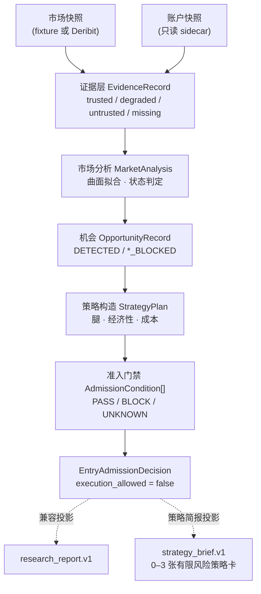
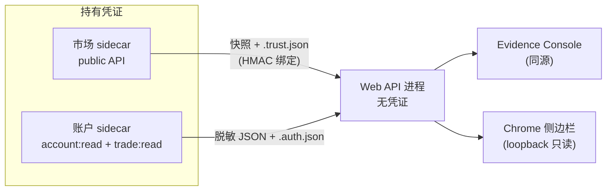

# 架构总览

面向贡献者。术语见[术语表](glossary.md)，端点契约见 [API 参考](api-reference.md)。

## 一句话概括

一条**单向的信任链路**：原始快照进来，逐段被降级或提升信任等级，最终止于一个
不可变的准入结论。链路上每一段都可以拒绝，但没有任何一段可以**创造**它没有证据
支撑的信息。

## 信任链路

公共入口 `build_analysis_record(...)` 先调用 `compute_analysis_inputs`，从原始快照产生不可变
`AnalysisInputs`，再经 `AnalysisRequest.from_inputs` 交给 `AnalysisRun.evaluate`。市场、账户
和研究计算分组保存；核心求值与策略简报不再先构建 `research_report.v1` 或读取兼容 runbook。
**可信链路严格止于 `EntryAdmissionDecision`。** `research_report.v1` 只是给
`/evidence`、Chrome 伴侣和旧客户端读取的兼容投影；其中残留的退出状态机、持仓与
sizing 叙述不属于可信记录，也不能反向影响准入。

当前一屏简报以 `strategy_brief.v1` 为合同，由内部证据页、公开版和 Chrome 侧栏消费。
旧 `strategy_research.v1` 及其诊断组件仍作为兼容内容存在。`AnalysisRequest.from_projection`
保留为旧调用方的适配器；明确请求 `project_research_report_v1()` 时，`CompatibilityProjection`
从同一组计算结果构建兼容 JSON，并在该条记录内惰性缓存。调用方得到独立副本，不能修改记录内部结果。

`build_analysis_record` 的既有参数与两种投影入口保留。v0.5.0 对策略卡内容有意收紧成本合同，
仅带 bool 含费标记的旧卡不再通过验证；前后端和扩展须一起升级，并从原始输入重新生成报告。
成本模型、配置与净权利金进入预测选腿身份，旧预测不能继承。按职责拆分不放宽证据门禁；构建身份和
输入身份契约变化会有意改变派生 ID，不能将历史 hash 不同直接解释为准入语义回归。

## 三条不变量

理解这三点，就能理解大部分代码为什么这样写。

**1. 不可变 + 单次求值**
同一输入版本在有效期内，各 GET 投影共享一个 `AnalysisRecord`。输入文件更新、证据有效期
或行情信任窗口到期会使缓存失效并建立新记录；旧记录本身不被修改。显式回放固定评估时钟。
服务不会因为网页刷新而自行采集行情。

**2. fail-closed 是默认值，不是分支**
`ConditionStatus.UNKNOWN` 与 `BLOCK` 一样不放行。新增检查项时，缺省路径必须是
「不通过」。任何「查不到就当作没问题」的写法都是 bug。

**3. 摘要是契约**
证据、报告与快照通过 SHA-256 绑定。所有摘要都必须经由
`crypto_options_report/_canonical.py` 的规范化编码计算——这是全局唯一的实现。
改动其中的 `sort_keys`、`separators`、`ensure_ascii` 或 `allow_nan`，会**静默
作废此前记录的每一个摘要**。`tests/test_canonical_encoding.py` 锁定了这个契约。

manifest 的 `analysis_inputs_hash` 绑定带类型的计算输入，`analysis_inputs_schema` 标识其合同；
旧字段 `projection_hash` 作为该输入摘要的兼容别名保留，不再表示临时构造的旧报告 JSON。
`build_info` 将 package version、源码摘要与 Git 观测状态分开记录。wheel 内嵌构建身份，离开
Git 目录仍能读取；源码进程在首次读取时固定身份，修改源码后应重启。Git 观测不等于签名或发布授权。

## 进程边界

生产环境建议拆成三个进程，凭证只存在于 sidecar：

要点：

- API 进程**从不**读取 `DERIBIT_CLIENT_ID` / `DERIBIT_CLIENT_SECRET`。
- 市场与账户使用**不同的**环境变量和**不同的** 32 字节 HMAC 密钥，互不通用。
- 快照 JSON **内部自带**的 `trust_evidence` 不被接受；信任必须来自独立的旁路文件，
  否则数据源就能自证可信。
- 账户 sidecar 未配置凭证时写出安全的 `missing/not_configured` 快照，不伪造账户状态。

## 模块地图

| 模块 | 职责 |
| --- | --- |
| `analysis_inputs.py` | 原始快照到不可变 `AnalysisInputs`；市场、账户和研究计算的带类型边界 |
| `analysis_run.py` | 领域模型、单次求值、机会/策略与不可变准入结果 |
| `admission_conditions.py` | 行情、机会策略、经济性、运行状态、账户/组合风险五组纯检查 |
| `compatibility_projection.py` | 明确请求旧报告时的惰性兼容投影与单记录缓存 |
| `contract.py` | `research_report.v1` 投影与逐节校验 |
| `strategy_brief.py` | canonical `strategy_brief.v1` 构建与合同校验 |
| `market_data.py` | Deribit 接入、快照规范化、质量门禁、信任状态推进 |
| `evidence_store.py` | 内容寻址的工件存储与回测作业状态 |
| `sidecar_auth.py` | HMAC 签名/校验，域分离 |
| `surface.py` · `regime.py` · `path_risk.py` | 曲面拟合、状态判定、路径风险 |
| `api.py` | stdlib HTTP 服务、鉴权、路由、投影缓存 |
| `cli.py` | 命令行入口 |
| `_canonical.py` | 全局唯一的规范化 JSON 编码 |
| `_logging.py` | API 与两个 sidecar 共用的结构化 JSON 日志；各进程补充固定字段 |
| `build_info.py` | 源码身份观测与安装包内嵌构建身份读取 |

`web/src/report/` 是前端侧的共享报告边界，`components/evidence/` 与 `sidepanel/`
共用它，避免两套界面对同一份报告得出不同解读。

## 教学与研究边界

`demo` 默认入口 `/index.html?view=demo` 是独立的三步教学导览；`LearningApp` 不请求研究 API，
研究服务不可用也可以完成学习。虚构标准化价格与线性
到期收益只用于解释有限风险结构，不写入 `research_report.v1`、`strategy_brief.v1` 或
历史/预测工件。“查看真实快照”切回证据页后，内置脱敏快照仍经过真实研究路径并保留阻断。

前端共享显示边界区分报告的评估时钟与读者当前时钟。历史通过不能恢复当前资格；加载失败
撤下旧结果，重试取得有效报告后才恢复显示。UI 状态修复不反向改变服务端证据状态。

信号和序列是独立研究工件。API 在读取后验证研究标记、允许 schema、时间与字段合同，
并递归拒绝执行/下单/推荐手数字段；合法的样本不足与来源排除记录仍保留。缺字段的手工旧工件
需要通过当前 CLI 重建，不能靠前端容错取得资格。

## 已完成的职责拆分与剩余边界

2026-09-05 的实现已拆开原始计算输入、领域求值和旧报告投影；准入条件也已移到五组具名函数。
完整候选路径保留既有 40 项条件的顺序、`PASS / BLOCK / UNKNOWN` 与原因码；证据层提前阻断时
只报告实际执行的检查。重复日志已统一到 `_logging.py`，这两项不再列为待办。

- `analysis_run.py` 仍包含领域模型、机会提取和策略构造，后续可按实际改动热点逐段拆分，不做
  一次性重写。
- 部分数值模块仍返回 JSON。`JsonDocument` 在输入边界校验、规范化并分离副本，按市场/账户/
  研究状态约束读取类型；这不代表全部嵌套数值字段都已成为独立领域类型。
- 旧客户端仍使用兼容 adapter 和旧报告字段。移除前须核对调用者并提供明确的合同迁移，不能只因
  主简报已切换就删除旧入口。

测试结果以实际运行记录为准。固定输入的结果、条件顺序和原因码是兼容证据；它们不证明研究模型已提升。

## 测试约定

测试基于 `tests/fixtures/` 中的固定快照与显式时钟，不访问网络。新增功能请覆盖
**证据缺失/损坏**路径——fail-closed 行为正是本项目的核心价值，happy path 反而是
次要的。

完整本地入口是 `python tools/verify.py`。它还从新构建的 wheel 启动 demo 完成真实浏览器
流程；`--quick` 仅用于快速反馈，明确跳过产物与浏览器检查。前置条件见
[贡献指南](../CONTRIBUTING.md#本地检查)。

无网络的公共入口复核使用 `python tools/reproduce_research.py --check`，输出包内快照的实际
trust、准入状态、证据缺口与构建绑定摘要；详见 [离线案例](guides/reproducible-case.md)。
